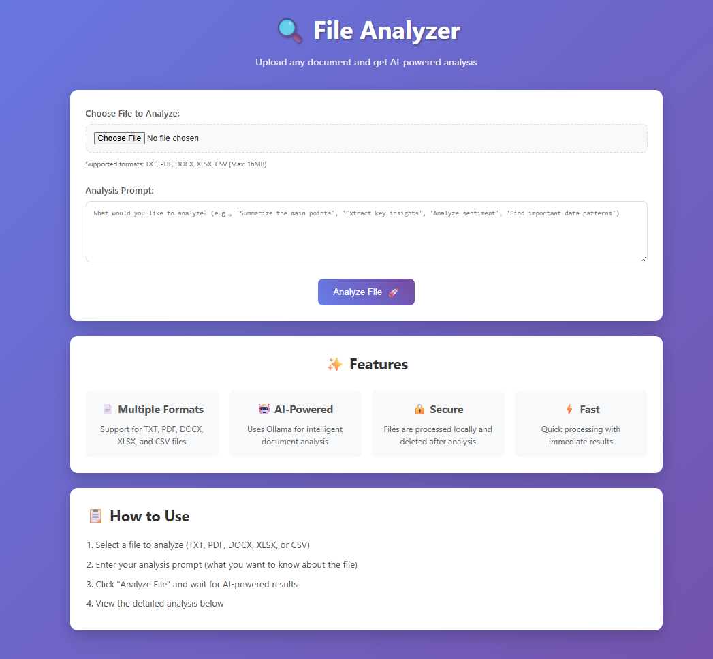

# 🔍 File Analyzer - AI-Powered Document Analysis

A modern web application that allows users to upload documents and get intelligent analysis using AI. Built with Flask, Python, and Ollama for local AI processing.

![File Analyzer]
   

## ✨ Features

- 📄 **Multi-format Support**: Handle TXT, PDF, DOCX, XLSX, and CSV files
- 🤖 **AI-Powered Analysis**: Uses Ollama for intelligent document processing
- 🔒 **Privacy-First**: All processing done locally, files deleted after analysis
- ⚡ **Fast Processing**: Quick analysis with immediate results
- 🎨 **Modern UI**: Clean, responsive interface with beautiful styling
- 📱 **Mobile Friendly**: Works seamlessly on desktop and mobile devices

## 🚀 Quick Start

### Prerequisites

- Python 3.7 or higher
- [Ollama](https://ollama.ai/) installed and running

### Installation

1. **Clone the repository**

   ```bash
   git clone https://github.com/evaibhav/Ai-File-Analyzer.git
   cd Ai-File-Analyzer
   ```

2. **Create virtual environment**

   ```bash
   python -m venv venv

   # On Windows
   venv\Scripts\activate

   # On macOS/Linux
   source venv/bin/activate
   ```

3. **Install dependencies**

   ```bash
   pip install -r requirements.txt
   ```

4. **Install and setup Ollama**

   - Download from [ollama.ai](https://ollama.ai/download)
   - Install for your operating system
   - Pull a model (e.g., llama2):
     ```bash
     ollama pull llama2
     ```

5. **Run the application**

   ```bash
   # Start Ollama service (in one terminal)
   ollama serve

   # Start the Flask app (in another terminal)
   python app.py
   ```

6. **Open your browser**
   Navigate to `http://localhost:5000`

## 📁 Project Structure

```
file-analyzer/
├── app.py                 # Main Flask application
├── requirements.txt       # Python dependencies
├── README.md             # Project documentation
├── uploads/              # Temporary file storage
├── templates/
│   └── index.html        # Main HTML template
└── static/
    └── style.css         # CSS styling
```

## 🔧 Usage

1. **Upload a File**: Choose from supported formats (TXT, PDF, DOCX, XLSX, CSV)
2. **Enter Analysis Prompt**: Describe what you want to analyze
3. **Get Results**: Receive AI-powered analysis instantly

### Example Prompts

- "Summarize the main points of this document"
- "Extract key insights and recommendations"
- "Analyze the sentiment and tone"
- "Find important data patterns and trends"
- "What are the key takeaways?"
- "Identify action items and next steps"

## 🛠️ Technical Details

### Built With

- **Backend**: Flask (Python web framework)
- **AI Processing**: Ollama (Local AI model runner)
- **Frontend**: HTML5, CSS3, JavaScript
- **File Processing**: PyPDF2, python-docx, pandas, openpyxl

### Supported File Formats

| Format | Extension | Description                  |
| ------ | --------- | ---------------------------- |
| Text   | `.txt`    | Plain text files             |
| PDF    | `.pdf`    | Portable Document Format     |
| Word   | `.docx`   | Microsoft Word documents     |
| Excel  | `.xlsx`   | Microsoft Excel spreadsheets |
| CSV    | `.csv`    | Comma-separated values       |

### API Endpoints

- `GET /` - Main application page
- `POST /upload` - File upload and analysis endpoint

## 🔒 Privacy & Security

- **Local Processing**: All AI processing happens locally using Ollama
- **No Data Storage**: Files are deleted immediately after analysis
- **Secure Upload**: File validation and secure filename handling
- **Size Limits**: 16MB maximum file size for security

## 🎨 Screenshots

### Main Interface


### Analysis Results


## 📊 Performance

- **File Processing**: < 2 seconds for most documents
- **AI Analysis**: 5-30 seconds depending on content length and model
- **Memory Usage**: Minimal, files processed in streaming fashion
- **Supported Models**: Any Ollama-compatible model

## 🤝 Contributing

Contributions are welcome! Please feel free to submit a Pull Request.

1. Fork the project
2. Create your feature branch (`git checkout -b feature/AmazingFeature`)
3. Commit your changes (`git commit -m 'Add some AmazingFeature'`)
4. Push to the branch (`git push origin feature/AmazingFeature`)
5. Open a Pull Request

## 📋 To-Do

- [ ] Add support for more file formats (RTF, ODT)
- [ ] Implement batch file processing
- [ ] Add export functionality for analysis results
- [ ] Create API endpoints for programmatic access
- [ ] Add user authentication and session management
- [ ] Implement analysis history and favorites
- [ ] Add support for multiple AI models
- [ ] Create Docker containerization

## 🐛 Known Issues

- Large PDF files (>10MB) may take longer to process
- Complex Excel files with multiple sheets only process the first sheet
- Some PDF files with complex formatting may have text extraction issues

## 🔧 Troubleshooting

### Common Issues

**1. Ollama Connection Error**

```bash
# Make sure Ollama is running
ollama serve

# Check if model is available
ollama list
```

**2. File Upload Issues**

- Check file size (max 16MB)
- Verify file format is supported
- Ensure file is not corrupted

**3. Module Import Errors**

```bash
# Ensure virtual environment is activated
source venv/bin/activate  # or venv\Scripts\activate on Windows

# Reinstall dependencies
pip install -r requirements.txt
```

## 📄 License

This project is licensed under the MIT License - see the [LICENSE](LICENSE) file for details.

## 🙏 Acknowledgments

- [Ollama](https://ollama.ai/) for providing local AI capabilities
- [Flask](https://flask.palletsprojects.com/) for the web framework
- [PyPDF2](https://pypdf2.readthedocs.io/) for PDF processing
- [python-docx](https://python-docx.readthedocs.io/) for Word document handling

## 📞 Support

If you encounter any issues or have questions:

1. Check the [Issues](https://github.com/evaibhav/Ai-File-Analyzer/issues) page.
2. Create a new issue with detailed description.
3. Join our [Discussion](https://github.com/evaibhav/Ai-File-Analyzer/discussions) forum.

---

**⭐ Star this repository if you find it helpful!**

Made with ❤️ by [VAIBHAV TRIPATHI](https://github.com/evaibhav)
